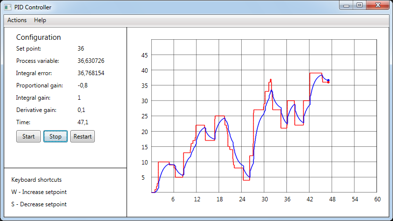

# About 

Приложение `PID-Controller-WPF` предназначено для моделирования **ПИД-регулятора** с целью контроля соответствия *управляемой величины* значению *заданного параметра*. 

Например, если необходимо обеспечить соответствие *реальной величины скорости движения* автомобиля величине *желаемой скорости*, то данное приложение может быть полезно при подборе параметров **ПИД-регулятора**. 

Приложение написано с использованием подхода **MVVM**. 



## Отрывки кода 

### Добавление новых элементов на график

Если Вы хотите добавить новый визуальный элемент на график (например, точки для SP и PV), Вам для начала необходимо в конструкторе класса `MainWindow` установить в ноль занчения `GraphCanvasVM.Setpoint` и `GraphCanvasVM.ProcessVariable`, после чего вызвать метод `DrawCoordinates()`, который позволит прорисовать координатную сетку и установить подписи к осям. 
```C#
namespace PidControllerWpf.View
{
    public partial class MainWindow : Window
    {
        public MainWindow()
        {
            InitializeComponent();
            ... 
            // When canvas is loaded, get size of Graph using lambda expression.
            Loaded += (o, e) => 
            {
                ...
                // Pass width and height of a canvas to the GraphCanvasVM 
                ((MainWindowViewModel)(this.DataContext)).GraphCanvasVM.Setpoint = 0; 
                ((MainWindowViewModel)(this.DataContext)).GraphCanvasVM.ProcessVariable = 0; 

                // Draw coordinates 
                DrawCoordinates();
                ...
            }; 
        }
        ... 
    }
}
```

После этого нужно перейти в `GraphCanvasVM`и определить булевые переменные `IsSpMovedToInitPoint` и `IsPvMovedToInitPoint`, которые используются для того, чтобы определить, были ли точки для SP и PV передвинуты в *начало координат*. 
```C#
namespace PidControllerWpf.ViewModel
{
    public class GraphCanvasVM : INotifyPropertyChanged
    {
        ...
        /// <summary>
        /// Boolean variable that shows if SP moved to (0,0) point on coordinates
        /// </summary>
        public bool IsSpMovedToInitPoint
        {
            get { return isSpMovedToInitPoint; }
            set { isSpMovedToInitPoint = (!value && !isSpMovedToInitPoint) ? false : true; }
        }

        /// <summary>
        /// Boolean variable that shows if PV moved to (0,0) point on coordinates
        /// </summary>        
        private bool isPvMovedToInitPoint = false; 
        public bool IsPvMovedToInitPoint
        {
            get { return isPvMovedToInitPoint; }
            set { isPvMovedToInitPoint = (!value && !isPvMovedToInitPoint) ? false : true; }
        }
        
        public bool IsEverStarted
        {
            get { return IsSpMovedToInitPoint && IsPvMovedToInitPoint; }
        }

        private double processVariable;
        public double ProcessVariable
        {
            get { return processVariable; }
            set 
            { 
                this.DrawVariable(ref value, false, true); 

                // Draw all lines 
                MainWindow.DrawCoordinates(); 
                MainWindow.DrawLine(SetpointLines);
                MainWindow.DrawLine(ProcessVarLines);
                
                processVariable = value; 
            }
        }
                
        private double setpoint; 
        /// <summary>
        /// Allows to move setpoint on the graph according to 
        /// the scale of a graph 
        /// </summary>
        public double Setpoint
        {
            get { return setpoint; } 
            set
            {
                this.DrawVariable(ref value, true, false); 

                // Draw all lines 
                MainWindow.DrawCoordinates(); 
                MainWindow.DrawLine(SetpointLines);
                MainWindow.DrawLine(ProcessVarLines);
                
                setpoint = value; 
            }
        }
        ...
        /// <summary>
        /// Clears all lists of lines used for drawing SP and PV
        /// </summary>
        public void ClearListOfLines()
        {
            SetpointLines.Clear();          // Clear list of lines
            ProcessVarLines.Clear();        // Clear list of lines
            MainWindow.DrawCoordinates();   // Draw line 
        }

        /// <summary>
        /// Allows to draw SP and PV
        /// </summary>
        private void DrawVariable(ref double value, bool isSetpoint, bool isPv)
        {
            double min = MainWindow.MinPvGraph; 
            double max = MainWindow.MaxPvGraph; 
            double VarLeft = 0; 
            double VarTop = 0; 
            Point ReferencePoint = new Point(); 
            List<Line> lines = null; 
            System.Windows.Media.Brush color = null; 

            // Assign variables for SP and PV setting
            if (isSetpoint)
            {
                VarLeft = this.SetpointLeft; 
                VarTop = this.SetpointTop; 
                ReferencePoint = this.SpRefPoint; 
                lines = this.SetpointLines; 
                color = System.Windows.Media.Brushes.Red; 
            }
            else if (isPv)
            {
                VarLeft = this.ProcessVariableLeft; 
                VarTop = this.ProcessVariableTop; 
                ReferencePoint = this.PvRefPoint; 
                lines = this.ProcessVarLines; 
                color = System.Windows.Media.Brushes.Blue; 
            }
            ...
            try
            {
                // Correct a list of lines 
                if (!IsTimerEnabled)
                {
                    // Assign ReferencePoint for the first time 
                    if (IsEverStarted)
                    {
                        ...
                    }
                    else
                    {
                        ReferencePoint = new Point(line.X2, line.Y2);

                        if (isSetpoint)
                        {
                            IsSpMovedToInitPoint = true; 
                        }
                        else if (isPv)
                        {
                            IsPvMovedToInitPoint = true; 
                        }
                    }
                else
                {
                    ...
                }
            catch (System.Exception e)
            {
                ExceptionViewer.WatchExceptionMessageBox(e); 
            }

            // Reassign variables for SP and PV setting
            if (isSetpoint)
            {
                this.SetpointLeft = VarLeft; 
                this.SetpointTop = VarTop; 
                this.SpRefPoint = ReferencePoint; 
                this.SetpointLines = lines; 
            }
            else if (isPv)
            {
                this.ProcessVariableLeft = VarLeft; 
                this.ProcessVariableTop = VarTop; 
                this.PvRefPoint = ReferencePoint; 
                this.ProcessVarLines = lines; 
            }
        }
        ...
    }
}
```

Также нужно добавить функционал для **сброса таймера** и возвращения всех визуальных элементов (точек) в *начало координат*. 
Для этого в классе `RestartTimerCommand` необходимо прописать следующее: 
```C#
namespace PidControllerWpf.Commands
{
    class RestartTimerCommand : ICommand
    {
        ...
        public void Execute(object parameter)
        {
            try
            {
                // Stop timer 
                this._PidViewModel.TimerGraph.Stop(); 
                
                // Assign `_GraphCanvasVM` as `gcvm` for convinience 
                GraphCanvasVM gcvm = this._PidViewModel._GraphCanvasVM; 

                // Say that timer is not enabled 
                gcvm.IsTimerEnabled = false; 

                // Set size of a window
                MainWindow.MinTimeGraph = 0; 
                MainWindow.MaxTimeGraph = 60; 

                // Set SP to zero 
                gcvm.Setpoint = 0; 
                _PidViewModel._TextBlockViewModel.SetPointTextBlock = $"{gcvm.Setpoint}"; 
                
                // Set PV to zero 
                gcvm.ProcessVariable = 0; 
                _PidViewModel._TextBlockViewModel.ProcessVariableTextBlock = $"{gcvm.ProcessVariable}"; 

                // Set time to zero
                gcvm.Time = 0; 
                _PidViewModel._TextBlockViewModel.TimeTextBlock = $"{gcvm.Time}";

                // Set reference point to be able to change SP while timer isn't enabled
                Point refpoint = new Point(gcvm.SetpointLeft, gcvm.SetpointTop + 2.5); 
                gcvm.SpRefPoint = refpoint; 

                // Clear list of lines 
                gcvm.ClearListOfLines(); 
            }
            catch (System.Exception e)
            {
                ExceptionViewer.WatchExceptionMessageBox(e);
            }
        }
    }
}
```